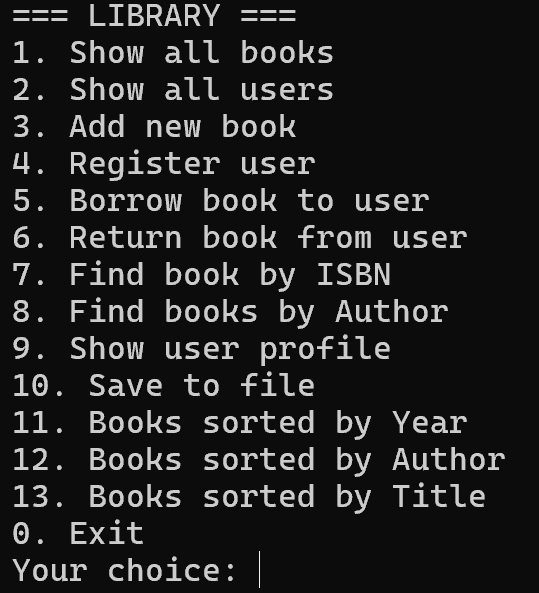
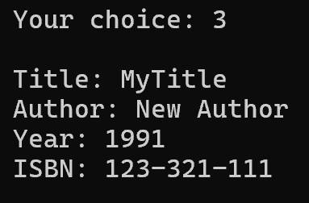
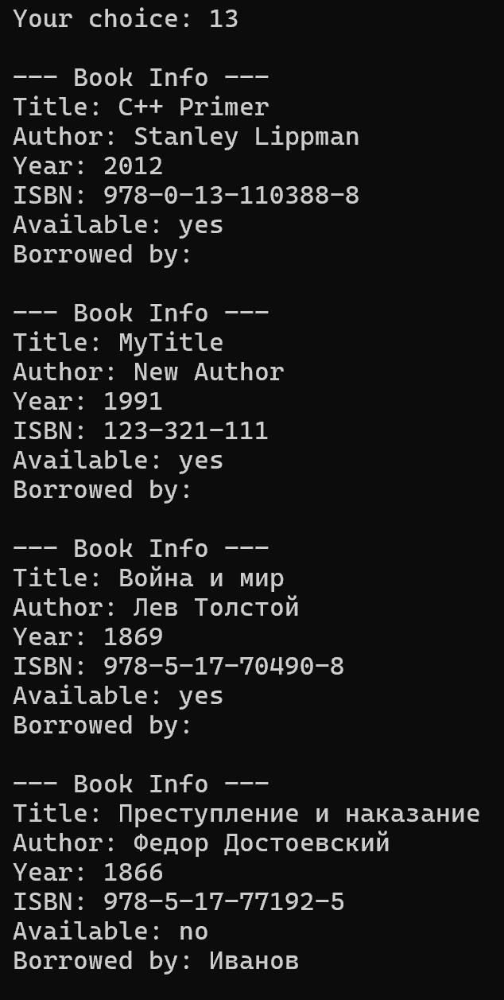

## Описание проекта
 Консольное приложение для управления личной библиотекой с использованием объектно-ориентированного программирования.

---
### Требования (C++20, CMake 3.10+)
---

### Сборка
```bash
git clone https://github.com/lnTheSky/cpp_lang
cd cpp_lang/lab_5-6

mkdir build
cd build
cmake ..
make
./library
```

### Примеры использования

**Главное меню**


**Добавление книги**


**Сортированные по названию**


---
### Что реализовано?

 - Весь базовый функционал (По ТЗ)
 - Сортировка по трём полям
 - Полная защита от всевозможных манипуляций с вводом (файл, пользовательский)
 - Поиск книг по автору
