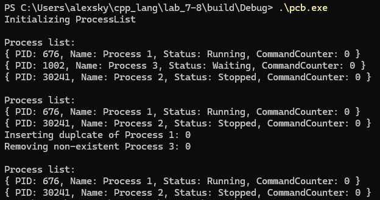

## Описание проекта
 Реализация класс для управления связанным списком блоков управления процессами.

---
### Требования
 - **C++20** 
 - **CMake 3.10+**
---

### Сборка
```bash
git clone https://github.com/lnTheSky/cpp_lang
cd cpp_lang/lab_7-8

mkdir build
cd build
cmake ..
make
./pcb
```
---

### Примеры использования


**Демонстрация работы**

---

### Что реализовано?

 - enum class Status
 - Регистры для x64 процессора
 - структура PCB с полем processID unsigned short (на PID выделено 16 бит)
 - Односвязный список ProcessList
 - Вставка с сортировкой и проверками
 - Удаление с проверками
 - Вывод списка на экран
 - Корректная работа с памятью
 - Удобный ProcessControlBlock модуль 
